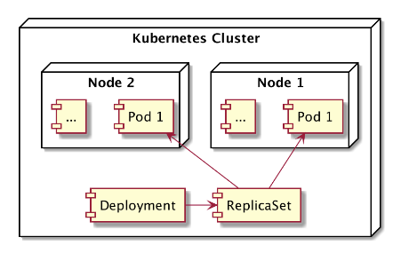
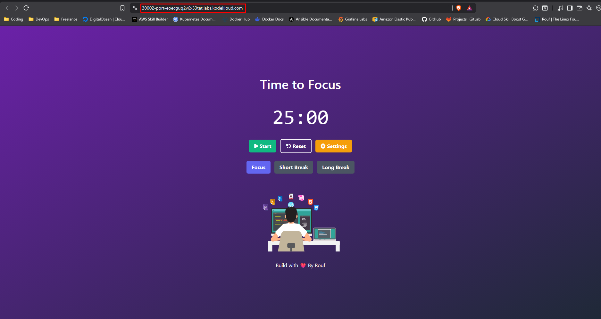

# Deployment
Deployment adalah fitur dari Kubernetes yang dapat digunakan untuk melakukan deployment dan update aplikasi secara deklaratif menggunakan file konfigurasi.
Mengapa harus menggunakan fitur Deployment dikarenakan jika kita melakukan update dengan cara manual itu sangat beresiko bisa mengakibatkan Aplikasi downtime, Sehingga aplikasi tidak dapat di akses.Saat melakukan Deployment secara otomatis Kubernetes akan membuat ReplicaSet, yang mana ReplicaSet akan secara otomatis membuat Pod.Membuat Deployment hampir sama seperti membuat ReplicaSet.

## Toplogi Deployment


## Implementasi Deployment

1. Running Deployment dan Service
```bash
controlplane ~/nodejs-deployment ➜  kubectl apply -f deployment.yaml 
deployment.apps/nodejs-web created
service/service-nodejs created
```

2. Lalu coba lihat apakah Deployment berhasil running
```bash
controlplane ~/nodejs-deployment ➜  kubectl get deployments
NAME         READY   UP-TO-DATE   AVAILABLE   AGE
nodejs-web   3/3     3            3           9s
```

3. Coba lihat semua resource Kubernetes, Dan disini Pod dan ReplicaSet otomatis terbuat menggunakan Fitur Deployment
```bash
controlplane ~/nodejs-deployment ➜  kubectl get all
NAME                             READY   STATUS    RESTARTS   AGE
pod/nodejs-web-878f8bc9c-fj748   1/1     Running   0          87s
pod/nodejs-web-878f8bc9c-h4bmv   1/1     Running   0          87s
pod/nodejs-web-878f8bc9c-qc2r7   1/1     Running   0          87s

NAME                     TYPE        CLUSTER-IP      EXTERNAL-IP   PORT(S)          AGE
service/kubernetes       ClusterIP   172.20.0.1      <none>        443/TCP          2m12s
service/service-nodejs   NodePort    172.20.123.19   <none>        2122:30002/TCP   87s

NAME                         READY   UP-TO-DATE   AVAILABLE   AGE
deployment.apps/nodejs-web   3/3     3            3           88s

NAME                                   DESIRED   CURRENT   READY   AGE
replicaset.apps/nodejs-web-878f8bc9c   3         3         3       87s
```

4. Cek Aplikasi NodeJS di Port EXTERNAL service 30002
