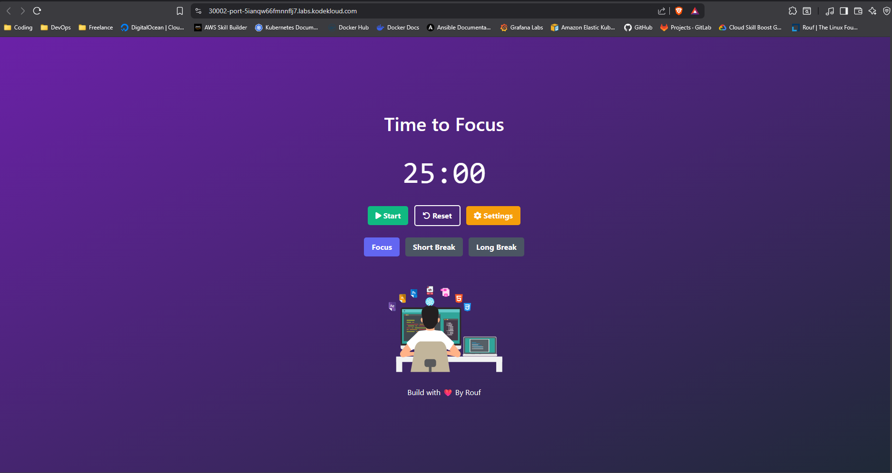

# ROLLBACK DEPLOYMENT
Rollback Deployment digunakan ketika terjadi masalah dengan aplikasi versi terbaru, Supaya tidak terjadi error terlalu lama kita bisa rollback atau kembali ke versi sebelumnya.Cara manualnya seperti mengganti versi aplikasi (versi image docker sebelumnya) ke sebelumnya dan melakukan deployment ulang namun itu terlalu lama saat digunakan di production.

## Kubernetes Rollout

1. kubectl rollout history object name = Melihat history rollout
2. kubectl rollout pause object name = Menandai sebagai pause
3. kubectl rollout resume object name = Resume pause
4. kubectl rollout restart object name = Merestart rollout
5. kubectl rollout status object name = Melihat status rollout 
6. kubectl rollout unda object name = Undo ke rollout sebelumnya (Kembali ke versi aplikasi sebelumnya)

## Implementasi Rollback Kubernetes
Untuk implementasinya disini saya akan melakukan Deployment menggunakan versi aplikasi 2.0.Jadi saya akan Deploy Aplikasi NodeJS versi 2.0 saya terlebih dahulu.Lalu nantinya akan saya update ke versi Latest dan saya Rollback Deployment ke versi 2.0 lagi.

1. Disini saya punya 2 file konfigurasi, File Deployment biasa berisi versi 2.0 dan yang Update berisi versi Latest.
```bash
controlplane ~/rollback-deployment ➜  ls
rollback-deployment.yaml  rollback-deployment-update.yaml
```

2. Melakukan Deployment di versi 2.0
```bash
controlplane ~/rollback-deployment ➜  kubectl apply -f rollback-deployment.yaml 
deployment.apps/nodejs-web created
service/service-nodejs unchanged
```

3. Melihat versi riwayat(history) dibuatnya Deployment.Terlihat disini Deployment memiliki 1 riwayat karena baru saja dibuat. 
```bash
controlplane ~/rollback-deployment ➜  kubectl rollout history deployment nodejs-web 
deployment.apps/nodejs-web 
REVISION  CHANGE-CAUSE
1         <none>
```

4. Melihat status rollback untuk memantau proses perubahan pada Deployment.
```bash
controlplane ~/rollback-deployment ➜  kubectl rollout status deployment nodejs-web 
deployment "nodejs-web" successfully rolled out
```

5. Saya melakukan Update Deployment versi latest pada bagian Image container.
```bash
controlplane ~/rollback-deployment ➜  kubectl apply -f rollback-deployment-update.yaml 
deployment.apps/nodejs-web configured
service/service-nodejs unchanged
```

6. Memantau perubahan dengan melihat status Rollback
```bash
controlplane ~/rollback-deployment ➜  kubectl rollout status deployment nodejs-web 
Waiting for deployment "nodejs-web" rollout to finish: 2 out of 3 new replicas have been updated...
Waiting for deployment "nodejs-web" rollout to finish: 2 out of 3 new replicas have been updated...
Waiting for deployment "nodejs-web" rollout to finish: 2 out of 3 new replicas have been updated...
Waiting for deployment "nodejs-web" rollout to finish: 1 old replicas are pending termination...
Waiting for deployment "nodejs-web" rollout to finish: 1 old replicas are pending termination...
deployment "nodejs-web" successfully rolled out
```

7. Saya lihat di browser apakah update Deployment berhasil dilakukan 
 


8. Melakukan Rollback undo atau kembali ke versi Deployment sebelumnya. 
Apa yang terjadi saat command ini di eksekusi?
Kubernetes akan :
- Melihat riwayat versi dan menemukan versi stabil sebelumnya
- Secara bertahap akan mematikan Pod Pod versi baru yang bermasalah
- Secara bersamaan saat sedang mematikan Pod Pod bermasalah, Kubernetes akan membuat Pod Pod baru menggunakan konfigurasi versi sebelumnya yang stabil.
```bash
controlplane ~/rollback-deployment ➜  kubectl rollout undo deployment nodejs-web 
deployment.apps/nodejs-web rolled back
```

9. Verifikasi versi aplikasi apakah kembali ke versi 2.0


note:
- versi latest tidak akan memunculkan teks di footer atau teks versi apapun
- versi 2.0 akan memunculkan teks versi 2.0 di bagian footer aplikasi