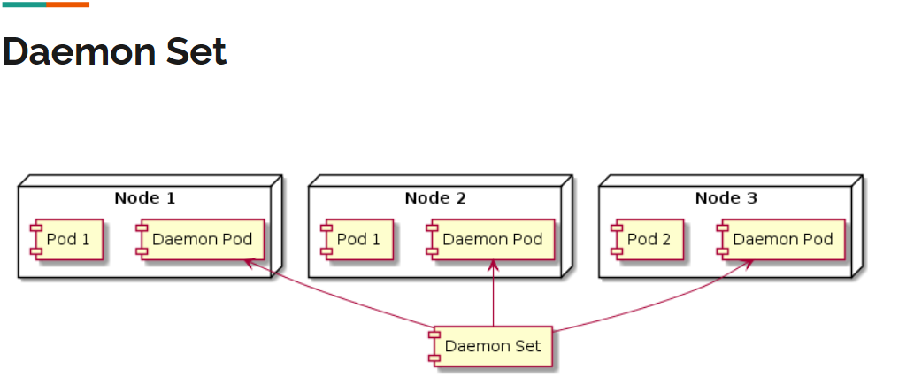

# DAEMON SET
* Daemon Set berguna untuk kita yang ingin menjalankan Pod di setiap Node di Kubernetes, Dan tiap Pod hanya boleh jalan di 1 Node, Secara default Daemon Set akan menjalankan Pod di setiap Node pada Kubernetes Cluster.Kecuali kita mengatur ke Node tertentu.


## TOPOLOGI DAEMON SET

source YT PPT Programmer Zaman Now
 
## Contoh kasus penggunaan Daemon Set
* Aplikasi untuk monitoring Node
* Aplikasi untuk mengambil log di Node
* Dll.

### * Command membuat Daemon Set

1. Running pod
```bash
kubectl apply -f daemonSet-nginx.yaml
```

2. Melihat semua Daemon Set
```bash
kubectl get daemonsets
```
3. Menghapus Daemon Set
```bash
kubectl delete daemonsets nama-daemon-set
```

4. Menghapus Daemon Set (Contoh)
```bash
kubectl delete daemonsets nginx-daemonset
```

* Implementasi LOG
```bash
laborant@dev-machine:daemon-set$ kubectl get daemonsets
NAME              DESIRED   CURRENT   READY   UP-TO-DATE   AVAILABLE   NODE SELECTOR   AGE
nginx-daemonset   3         3         3       3            3           <none>          21s
laborant@dev-machine:daemon-set$ kubectl get pods
NAME                    READY   STATUS    RESTARTS   AGE
nginx-daemonset-qwlm7   1/1     Running   0          3m32s
nginx-daemonset-tj97w   1/1     Running   0          3m32s
nginx-daemonset-whs6p   1/1     Running   0          3m32s
laborant@dev-machine:daemon-set$ 
```

```bash
laborant@dev-machine:daemon-set$ kubectl delete daemonsets nginx-daemonset
daemonset.apps "nginx-daemonset" deleted from default namespace
```