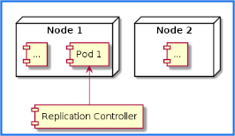
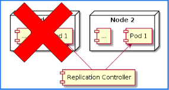

# REPLICATION CONTROLLER
Replication Controller bertugas untuk memastikan bahwa pod selalu berjalan, Jika tiba tiba Pod mati atau hilang, Misal ketika ada Node yang mati.Maka Replication Controller secara otomatis akan menjalankan Pod yang mati atau hilang tersebut.

Replication Controller biasanya ditugaskan untuk memanage lebih dari 1 Pod 

Replication Controller akan memastikan jumlah pod berjalan sesuai jumlah yang ditentukan.Jika lebih maka rc akan menghapus pod yang ada.

## Topology Replication Controller

## Ketika Terjadi Masalah

[teks biru] (Source gambar : PPT Programmer Zaman Now Kelas Kubernetes)