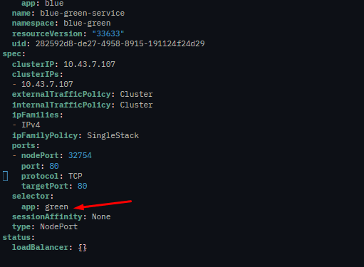

# Apa itu Blue Green Deployment?
Blue-Green Deployment adalah strategi rilis aplikasi di mana Anda memiliki dua lingkungan produksi yang identik berjalan secara paralel.
Dalam konteks Kubernetes, ini berarti memiliki dua versi aplikasi (Deployment) yang berjalan di dalam cluster yang sama, tetapi trafik user hanya diarahkan ke satu versi pada satu waktu.

## Example Topology Blue Green Deployment


### Implementasi Blue Green Deployment

1. Membuat namespace khusus
```bash
kubectl crate ns blue-green
```

2. Membuat Deployment untuk blue version
```bash
kubectl create deployment blue --image nginx --replicas 3 -n blue-green
```

3. Mengexpose service dari deployment menggunakan NodePort
```bash
kubectl expose deployment blue --name blue-green-service -n blue-green --port 80 --target-port 80 --type NodePort
```

4. Cek Deployment dan Service

example:
```bash
root@rouf:~# kubectl get all -n blue-green
NAME                        READY   STATUS    RESTARTS   AGE
pod/blue-78f8fb8666-gwvjm   1/1     Running   0          3h45m
pod/blue-78f8fb8666-k4flr   1/1     Running   0          3h45m
pod/blue-78f8fb8666-m27tt   1/1     Running   0          3h45m

NAME                         TYPE       CLUSTER-IP    EXTERNAL-IP   PORT(S)        AGE
service/blue-green-service   NodePort   10.43.7.107   <none>        80:32754/TCP   3h38m

NAME                   READY   UP-TO-DATE   AVAILABLE   AGE
deployment.apps/blue   3/3     3            3           3h45m

NAME                              DESIRED   CURRENT   READY   AGE
replicaset.apps/blue-78f8fb8666   3         3         3       3h45m
```

5. Melakukan testing apakah deployment blue version berhasil berjalan dan bisa diakses di browser
```bash
curl IP:NodePort
```
example:
```bash
curl 192.168.101.79:32754
```

6. Membuat Deployment untuk green version
```bash
kubectl create deployment green --image httpd --replicas 3 --n blue-green
```

7. Edit service blue-green-service
```bash
kubectl edit svc blue-green-service -n blue-green
```

8. Ganti selector servicenya menjadi dari label aplikasi blue menjadi green


9. testing menggunakan IP dan NodePort
```bash
curl IP:NodePort
```
example
```bash
root@rouf:~# curl 192.168.101.79:32754
<!DOCTYPE HTML PUBLIC "-//W3C//DTD HTML 4.01//EN" "http://www.w3.org/TR/html4/strict.dtd">
<html>
<head>
<title>It works! Apache httpd</title>
</head>
<body>
<p>It works!</p>
</body>
</html>
```

10. Lalu coba implementasikan ganti menjadi selector label ke aplikasi blue, setelah itu testing
```bash
root@rouf:~# curl 192.168.101.79:32754
<!DOCTYPE html>
<html>
<head>
<title>Welcome to nginx!</title>
<style>
html { color-scheme: light dark; }
body { width: 35em; margin: 0 auto;
font-family: Tahoma, Verdana, Arial, sans-serif; }
</style>
</head>
<body>
<h1>Welcome to nginx!</h1>
<p>If you see this page, the nginx web server is successfully installed and
working. Further configuration is required.</p>

<p>For online documentation and support please refer to
<a href="http://nginx.org/">nginx.org</a>.<br/>
Commercial support is available at
<a href="http://nginx.com/">nginx.com</a>.</p>

<p><em>Thank you for using nginx.</em></p>
</body>
</html>
```
