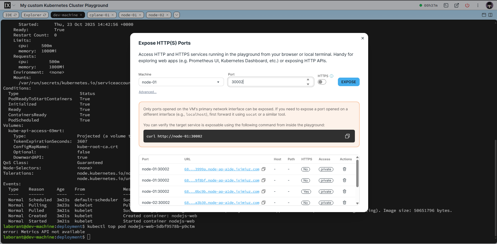
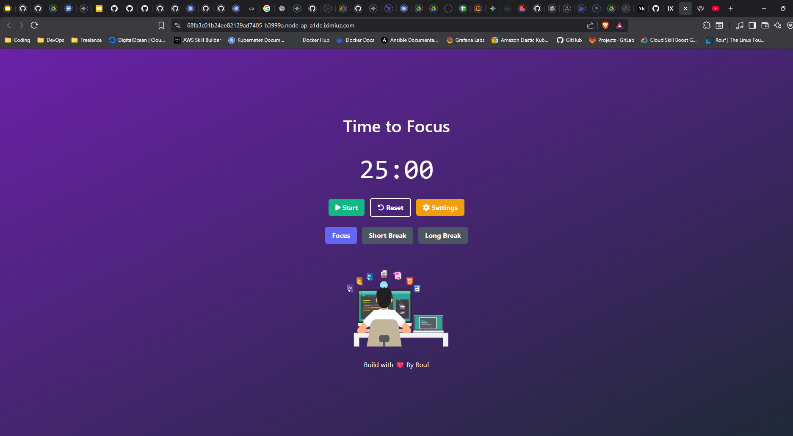

# COMPUTATIONAL RESOURCE
Computational resource adalah sumber daya dasar untuk Pod atau Container seperti resource CPU dan Memori untuk masing masing Pod.Secara default Pod disebuah Node akan bebas mengkonsumsi resource yang ada didalam Node tersebut tanpa batasan.Nah disitu ada satu masalah yang muncul ketika ada satu Pod yang sibuk(Misalnya menerima traffic atau beban tugas yang berat), Pod yang sibuk ini bisa menghabiskan sebagian besar CPU atau Memori di Node.Akibatnya Pod-Pod lain yang kebetulan berada di Node yang sama akan kekurangan resource, menjadi lambat, atau bahkan crash.Fenomena ini di Kubernetes di sebut dengan julukan "noisy neighbor".Maka dari itu perlu membatasi jumlah resource yang digunakan oleh Pod hal ini supaya tidak terjadi perebutan resource antar Pod.Jangan sampai satu Pod sibuk membuat Pod lainnya menjadi lambat didalam satu Node.

## Request dan Limit
Request dan Limit adalah cara membatasi resource yang akan di pakai oleh Pod didalam sebuah Node.Ini seperti mekanisme Kubernetes untuk mengontrol pembatasan Memory dan CPU.

- Request adalah apa yang container dapatkan, Jadi sebuah container dapat meminta request.Nantinya Kubernetes hanya akan menjalankannya didalam Node yang memiliki resource tersebut.

- Limit adalah cara untuk memastikan bahwa container tidak melewati resource yang telah ditentukan.Jadi seperti membatasi resource yang dapat di peroleh oleh container nantinya.Container hanya boleh menggunakan resource sampai limit tidak boleh lebih.

## Implementasi Request dan Limit 

1. Saya membuat Deployment dan Service dengan implementasi Limit dan Request Resource
```bash
laborant@dev-machine:deployment$ ls
pod-with-resource.yaml
laborant@dev-machine:deployment$ kubectl apply -f pod-with-resource.yaml 
deployment.apps/nodejs-web created
service/nodejs-service created
```

2. Memverifikasi apakah semua Pod dan Service berjalan
```bash
laborant@dev-machine:deployment$ kubectl get all
NAME                             READY   STATUS    RESTARTS   AGE
pod/nodejs-web-5dbf9578b-9ct9k   1/1     Running   0          20s
pod/nodejs-web-5dbf9578b-brz7g   1/1     Running   0          20s
pod/nodejs-web-5dbf9578b-p9ctm   1/1     Running   0          20s

NAME                     TYPE        CLUSTER-IP       EXTERNAL-IP   PORT(S)          AGE
service/kubernetes       ClusterIP   10.96.0.1        <none>        443/TCP          4m16s
service/nodejs-service   NodePort    10.100.232.190   <none>        2022:30002/TCP   20s

NAME                         READY   UP-TO-DATE   AVAILABLE   AGE
deployment.apps/nodejs-web   3/3     3            3           20s

NAME                                   DESIRED   CURRENT   READY   AGE
replicaset.apps/nodejs-web-5dbf9578b   3         3         3       20s
```

3. Melihat Resource yang dibuat dari file konfigurasi
```bash
laborant@dev-machine:deployment$ kubectl get -f pod-with-resource.yaml 
NAME                         READY   UP-TO-DATE   AVAILABLE   AGE
deployment.apps/nodejs-web   3/3     3            3           40s

NAME                     TYPE       CLUSTER-IP       EXTERNAL-IP   PORT(S)          AGE
service/nodejs-service   NodePort   10.100.232.190   <none>        2022:30002/TCP   40s
```

4. Disini saya mengimplementasikannya menggunakan Playground Iximuz Labs yang gratis untuk digunakan belajar Kubernetes.Disini saya menggunakan fitur Expose HTTP(s) Ports, Fitur ini berguna untuk memverifikasi apakah Aplikasi didalam Kubernetes bisa berjalan dan bisa diakses lewat Browser.Untuk implementasi, Saya menggunakan Service NodePort yang kerap saya pakai.


5. Memverifikasi apakah aplikasi berjalan di browser (Menggunakan Service NodePort)


6. Untuk melihat apakah implementasi Limit dan Request berhasil bisa menggunakan command Describe untuk melihat detail lebih lengkap di salah satu Pod.Bisa di lihat disini berhasil membuat Limit dan Request.
```bash
laborant@dev-machine:deployment$ kubectl describe pod nodejs-web-5dbf9578b-p9ctm 
Name:             nodejs-web-5dbf9578b-p9ctm
Namespace:        default
Priority:         0
Service Account:  default
Node:             cplane-01/172.16.0.2
Start Time:       Thu, 23 Oct 2025 14:42:54 +0000
Labels:           app=nodejs
                  pod-template-hash=5dbf9578b
Annotations:      <none>
Status:           Running
IP:               10.244.0.5
IPs:
  IP:           10.244.0.5
Controlled By:  ReplicaSet/nodejs-web-5dbf9578b
Containers:
  nodejs-web:
    Container ID:   containerd://d096f01413e5db3acf168235f0f77741ca529e4d5ded9d3675ebb35d1a8586b0
    Image:          mochabdulrouf/nodejs-focustimer-app
    Image ID:       docker.io/mochabdulrouf/nodejs-focustimer-app@sha256:a019023c10dadd5371b1cf18a99778db9ad784b987a2bf46628bda6dc67dda86
    Port:           2122/TCP
    Host Port:      0/TCP
    State:          Running
      Started:      Thu, 23 Oct 2025 14:42:56 +0000
    Ready:          True
    Restart Count:  0
    Limits:
      cpu:     500m
      memory:  1000Mi
    Requests:
      cpu:        500m
      memory:     1000Mi
    Environment:  <none>
    Mounts:
      /var/run/secrets/kubernetes.io/serviceaccount from kube-api-access-69mrt (ro)
Conditions:
  Type                        Status
  PodReadyToStartContainers   True 
  Initialized                 True 
  Ready                       True 
  ContainersReady             True 
  PodScheduled                True 
Volumes:
  kube-api-access-69mrt:
    Type:                    Projected (a volume that contains injected data from multiple sources)
    TokenExpirationSeconds:  3607
    ConfigMapName:           kube-root-ca.crt
    Optional:                false
    DownwardAPI:             true
QoS Class:                   Guaranteed
Node-Selectors:              <none>
Tolerations:                 node.kubernetes.io/not-ready:NoExecute op=Exists for 300s
                             node.kubernetes.io/unreachable:NoExecute op=Exists for 300s
Events:
  Type    Reason     Age    From               Message
  ----    ------     ----   ----               -------
  Normal  Scheduled  3m23s  default-scheduler  Successfully assigned default/nodejs-web-5dbf9578b-p9ctm to cplane-01
  Normal  Pulling    3m23s  kubelet            Pulling image "mochabdulrouf/nodejs-focustimer-app"
  Normal  Pulled     3m21s  kubelet            Successfully pulled image "mochabdulrouf/nodejs-focustimer-app" in 1.767s (1.767s including waiting). Image size: 50651796 bytes.
  Normal  Created    3m21s  kubelet            Created container: nodejs-web
  Normal  Started    3m21s  kubelet            Started container nodejs-web
```

