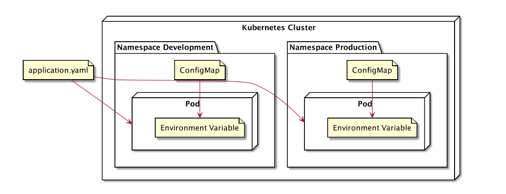
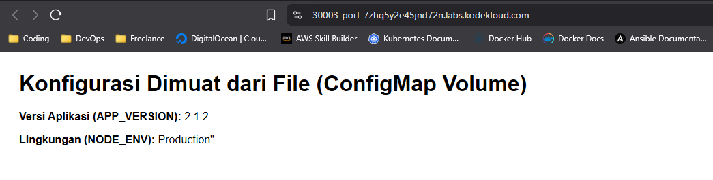

# CONFIG MAP
Apa itu ConfigMap? ConfigMap merupakan sebuah resource di Kubernetes yang digunakan untuk menyimpan data konfigurasi non-secret dalam bentuk key-value.

Kegunaan ConfigMap adalah untuk memisahkan konfigurasi dari kode aplikasi. Misalnya, jika sebuah aplikasi memiliki lingkungan development, staging, dan production, kita tidak perlu membuat image container yang berbeda untuk setiap lingkungan.

Dengan menggunakan ConfigMap, Kubernetes dapat memisahkan konfigurasi ke dalam objeknya sendiri. Aplikasi di dalam Pod kemudian bisa menggunakan konfigurasi ini melalui dua cara utama:

Sebagai Environment Variables: Kubernetes menyuntikkan data dari ConfigMap menjadi environment variable di dalam container.

Sebagai File di dalam Volume: Kubernetes memasang (mount) data dari ConfigMap sebagai file di dalam sebuah direktori di container.

Cara ini memastikan konfigurasi dikelola secara terpusat dan fleksibel.

Untuk lebih jelasnya seperti ini coba Bayangkan betapa repotnya jika setiap kali Anda ingin mengubah tingkat kesulitan dari Easy ke Hard, Anda harus mengunduh ulang seluruh game (puluhan Gigabyte). Tentu tidak praktis.

Begitu pula dengan aplikasi. Daripada menulis "tingkat kesulitan" di dalam kode aplikasi, kita menaruhnya di "menu pengaturan" (ConfigMap). Jadi, jika kita ingin mengubahnya, kita cukup mengubah pengaturannya saja, tanpa perlu membangun ulang aplikasi.

Seperti itulah Deskripsi sederhananya supaya lebih paham Config Map


## TOPOLOGI Config Map


## Implementasi Config Map
Berikut penerapan Config Map pada Cluster Kubernetes.

1. Running Config Map, Replica Set, Service
```bash
controlplane ~/nodejs-env ➜  kubectl apply -f nodejs-configmap.yaml 
configmap/nodejs-configmap unchanged
replicaset.apps/nodejs-env created
service/nodejs-env-serv configured
```

2. Melihat semua resource Kubernetes 
```bash
controlplane ~/nodejs-env ➜  kubectl get all
NAME                   READY   STATUS    RESTARTS   AGE
pod/nodejs-env-mzpqt   1/1     Running   0          32s
pod/nodejs-env-qw9ww   1/1     Running   0          32s
pod/nodejs-env-z6ckx   1/1     Running   0          32s

NAME                      TYPE        CLUSTER-IP       EXTERNAL-IP   PORT(S)          AGE
service/kubernetes        ClusterIP   172.20.0.1       <none>        443/TCP          55m
service/nodejs-env-serv   NodePort    172.20.241.249   <none>        2122:30002/TCP   3m44s

NAME                         DESIRED   CURRENT   READY   AGE
replicaset.apps/nodejs-env   3         3         3       32s
```

3. Masuk ke dalam container dan cek apakah environment variable dari config map telah masuk ke environment Container.
```bash
controlplane ~/nodejs-env ➜  kubectl exec nodejs-env-mzpqt -it -- /bin/sh
/app # env
KUBERNETES_PORT=tcp://172.20.0.1:443
KUBERNETES_SERVICE_PORT=443
NODEJS_ENV_SERV_PORT_2122_TCP_PORT=2122
NODE_VERSION=18.20.8
NODEJS_ENV_SERV_PORT_2122_TCP_PROTO=tcp
HOSTNAME=nodejs-env-mzpqt
YARN_VERSION=1.22.22
SHLVL=1
HOME=/root
NODEJS_ENV_SERV_SERVICE_HOST=172.20.241.249
NODEJS_ENV_SERV_PORT_2122_TCP=tcp://172.20.241.249:2122
NODEJS_ENV_SERV_PORT=tcp://172.20.241.249:2122
NODEJS_ENV_SERV_SERVICE_PORT=2122
TERM=xterm
KUBERNETES_PORT_443_TCP_ADDR=172.20.0.1
PATH=/usr/local/sbin:/usr/local/bin:/usr/sbin:/usr/bin:/sbin:/bin
KUBERNETES_PORT_443_TCP_PORT=443
KUBERNETES_PORT_443_TCP_PROTO=tcp
KUBERNETES_PORT_443_TCP=tcp://172.20.0.1:443
KUBERNETES_SERVICE_PORT_HTTPS=443
KUBERNETES_SERVICE_HOST=172.20.0.1
PWD=/app
NODE_ENV=Staging
APP_VERSION=2.1.2
NODEJS_ENV_SERV_PORT_2122_TCP_ADDR=172.20.241.249
```

4. Melihat Config Map yang telah dibuat
```bash
controlplane ~/nodejs-env ➜  kubectl get configmaps 
NAME               DATA   AGE
kube-root-ca.crt   1      58m
nodejs-configmap   2      6m37s
```

5. Melihat lebih lengkap isi Config Map
```bash
controlplane ~/nodejs-env ➜  kubectl describe configmaps nodejs-configmap 
Name:         nodejs-configmap
Namespace:    default
Labels:       <none>
Annotations:  <none>

Data
====
APP_VERSION:
----
2.1.2

NODE_ENV:
----
Staging


BinaryData
====

Events:  <none>
```  

## Implementasi Config Map With Volume (Mount Volume)
Berikut adalah Penerapan Config Map dengan tambahan menggunakan Volume untuk membuat Key Value dari Config Map di catat di sebuah file yang nantinya akan bisa dilihat di browser.Walaupun tertulis di sebuah file dan dimasukan ke path Container, Key dan Value dari Config Map tetap Masuk ke Environment di dalam Container.

1. Running Config Map, Replica Set, Service
```bash
controlplane ~/nodejs-configmap-volume ➜  kubectl apply -f nodejs-configmap-volume.yaml 
configmap/nodejs-configmap unchanged
replicaset.apps/nodejs-env created
service/nodejs-env-serv unchanged
```

2. Melihat semua Resource Kubernetes
```bash
controlplane ~/nodejs-configmap-volume ➜  kubectl get all
NAME                   READY   STATUS    RESTARTS   AGE
pod/nodejs-env-7prms   1/1     Running   0          14s
pod/nodejs-env-kbtp5   1/1     Running   0          14s

NAME                      TYPE        CLUSTER-IP       EXTERNAL-IP   PORT(S)          AGE
service/kubernetes        ClusterIP   172.20.0.1       <none>        443/TCP          26m
service/nodejs-env-serv   NodePort    172.20.104.250   <none>        2122:30003/TCP   4m35s

NAME                         DESIRED   CURRENT   READY   AGE
replicaset.apps/nodejs-env   2         2         2       14s
```

3. Mencoba melihat apakah key dan value masuk ke file dan bisa di akses lewat browser
```bash
controlplane ~/nodejs-configmap-volume ➜  curl http://172.20.104.250:2122/

    <html>
      <head>
        <title>Info ConfigMap</title>
        <style>body { font-family: sans-serif; padding: 20px; }</style>
      </head>
      <body>
        <h1>Konfigurasi Dimuat dari File (ConfigMap Volume)</h1>
        <p><strong>Versi Aplikasi (APP_VERSION):</strong> 2.1.2</p>
        <p><strong>Lingkungan (NODE_ENV):</strong> Production"</p>
      </body>
    </html>
```

4. Melihat hasil Key dan Value apakah masuk ke dalam Environment didalam Container
```bash
controlplane ~/nodejs-configmap-volume ➜  kubectl exec nodejs-env-dr5dg -it -- /bin/sh
/app # env
KUBERNETES_PORT=tcp://172.20.0.1:443
KUBERNETES_SERVICE_PORT=443
NODEJS_ENV_SERV_PORT_2122_TCP_PORT=2122
NODE_VERSION=18.20.8
NODEJS_ENV_SERV_PORT_2122_TCP_PROTO=tcp
HOSTNAME=nodejs-env-dr5dg
YARN_VERSION=1.22.22
SHLVL=1
HOME=/root
NODEJS_ENV_SERV_SERVICE_HOST=172.20.192.160
NODEJS_ENV_SERV_PORT_2122_TCP=tcp://172.20.192.160:2122
NODEJS_ENV_SERV_PORT=tcp://172.20.192.160:2122
NODEJS_ENV_SERV_SERVICE_PORT=2122
app.properties=APP_VERSION=2.1.2
NODE_ENV=Production"

TERM=xterm
KUBERNETES_PORT_443_TCP_ADDR=172.20.0.1
PATH=/usr/local/sbin:/usr/local/bin:/usr/sbin:/usr/bin:/sbin:/bin
KUBERNETES_PORT_443_TCP_PORT=443
KUBERNETES_PORT_443_TCP_PROTO=tcp
KUBERNETES_SERVICE_PORT_HTTPS=443
KUBERNETES_PORT_443_TCP=tcp://172.20.0.1:443
KUBERNETES_SERVICE_HOST=172.20.0.1
PWD=/app
NODEJS_ENV_SERV_PORT_2122_TCP_ADDR=172.20.192.160
```

5. Melihat langsung hasil Key dan Value yang di tulis di file oleh aplikasi NodeJS lewat Browser langsung.


6. Cara delete sebuah Config Map
```bash
kubectl delete configmap namaconfigmap
```