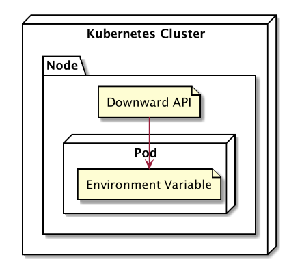

# Downward API

Konfigurasi yang di set manual bisa di tangani menggunakan Config Map dan Secret, Namun ada juga Konfigurasi Dinamis seperti informarsi Pod dan Node.Downward API bisa menangani hal tersebut dengan mengambi informarsi Pod dan Node melalui Environment Variable.Kata API pada Downward buka bermakna RESTful API, Ini hanya cara untuk mendapatkan informarsi seputar Node dan Pod.

## Apa perbedaannya dengan kita menggunakan command "kubectl describe .." pada Node atau Pod ?
Perbedaannya Downward API digunakan untuk memberikan seputar informarsi Pod atau Node kepada Aplikasi didalam Pod karena Aplikasi didalam Pod itu seperti terkurung tidak punya akses command "kubectl".Jadi singkatnya memberikan informarsi mengenai lingkungannya ke Aplikasi itu sendiri.

## Topologi Downward API


## Metadata Downward API
Metadata adalah sebuah rincian tentang sebuah data informarsi seperti nama Node, Pod, Namespace, DLL. Simplenya seperti nama produk, tanggal kadaluwarsa, nama produsen seperti itu contoh simpelnya untuk perumpamaan.Berikut Metadata yang dapat digunakan untuk memberikan informarsi kepada Aplikasi didalam Pod.

## Metadata (1)
- request.cpu = Jumlah CPU yang di request
- request.memory = Jumlah Memory yang di request
- limits.cpu = Jumlah limit maksimal CPU
- limits.memory = Jumlah limit maksimal memory

## Metadata (2)
- metadata.name = Nama Pod
- metadata.namespace = Namespace Pod
- metadata.uid = Id Pod
- metadata.labels['<KEY>'] = Label Pod
- metadata.annotations['<KEY>'] = Annotation Pod

## Metadata (3)
- status.podIP = IP address Pod
- spec.serviceAccountName = Nama service account Pod
- spec.nodeName = Nama node
- status.hostIP = Ip address Node

## Implementasi Downward API 

1. Running Downward API
```bash
controlplane ~/Downward-API ➜  kubectl apply -f downward-api.yaml 
configmap/nodejs-configmap created
replicaset.apps/nodejs-env created
service/nodejs-env-serv created
```

2. Melihat semua resource apakah running
```bash
controlplane ~/Downward-API ➜  kubectl get all
NAME                   READY   STATUS    RESTARTS   AGE
pod/nodejs-env-jxqgh   1/1     Running   0          26s
pod/nodejs-env-nqjgx   1/1     Running   0          27s
pod/nodejs-env-tw9jq   1/1     Running   0          26s

NAME                      TYPE        CLUSTER-IP      EXTERNAL-IP   PORT(S)          AGE
service/kubernetes        ClusterIP   172.20.0.1      <none>        443/TCP          79m
service/nodejs-env-serv   NodePort    172.20.246.57   <none>        2122:30002/TCP   27s

NAME                         DESIRED   CURRENT   READY   AGE
replicaset.apps/nodejs-env   3         3         3       27s
```

3. Hasil dari Downward API akan masuk ke Environment Variable didalam container yang nantinya Aplikasi dapat mengaksesnya.
```bash
controlplane ~/Downward-API ➜  kubectl exec nodejs-env-jxqgh -it -- /bin/sh
/app # env
POD_IP=172.17.1.2
KUBERNETES_SERVICE_PORT=443
KUBERNETES_PORT=tcp://172.20.0.1:443
NODEJS_ENV_SERV_PORT_2122_TCP_PORT=2122
NODE_VERSION=18.20.8
NODEJS_ENV_SERV_PORT_2122_TCP_PROTO=tcp
HOSTNAME=nodejs-env-jxqgh
YARN_VERSION=1.22.22
SHLVL=1
HOME=/root
NODEJS_ENV_SERV_SERVICE_HOST=172.20.246.57
NODEJS_ENV_SERV_PORT_2122_TCP=tcp://172.20.246.57:2122
NODEJS_ENV_SERV_PORT=tcp://172.20.246.57:2122
NODEJS_ENV_SERV_SERVICE_PORT=2122
POD_NODE_NAME=node01
TERM=xterm
POD_NAME=nodejs-env-jxqgh
KUBERNETES_PORT_443_TCP_ADDR=172.20.0.1
PATH=/usr/local/sbin:/usr/local/bin:/usr/sbin:/usr/bin:/sbin:/bin
KUBERNETES_PORT_443_TCP_PORT=443
KUBERNETES_PORT_443_TCP_PROTO=tcp
KUBERNETES_PORT_443_TCP=tcp://172.20.0.1:443
KUBERNETES_SERVICE_PORT_HTTPS=443
POD_NAMESPACE=default
KUBERNETES_SERVICE_HOST=172.20.0.1
PWD=/app
NODE_ENV=Staging
APP_VERSION=2.1.2
POD_NODE_IP=192.168.56.231
NODEJS_ENV_SERV_PORT_2122_TCP_ADDR=172.20.246.57
```