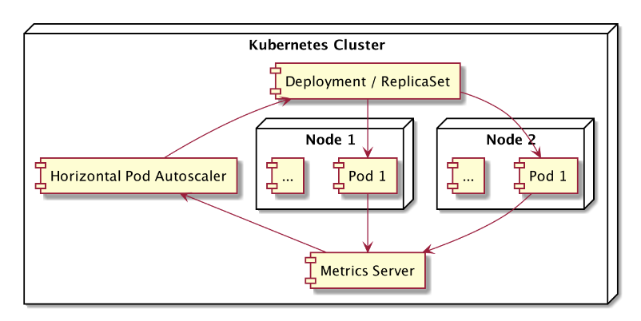

# Horizontal Pod AutoScaler 
Saat aplikasi sedang sibuk menangani task dan traffic sehingga konsumsi Memory dan CPU menjadi tinggi, Maka nantinya ada kemungkinan performa aplikasi menjadi menurun.Saat hal ini terjadi Application Scaling sangat dibutuhkan.Ada 2 jenis Application Scaling yaitu Vertical dan Horizontal Scaling.

## Vertical Scaling 
Vertical Scaling adalah cara agar Application Scaling mengupgrade computational resource di Aplikasi, Misal 1 CPU menjadi 2 CPU dan 1 GB memory menjadi 2 GB memory.Masalahnya di vertical scaling adalah ada batasannya, Pod di kubernetes tidak bisa melebihi batasan resource yang telah ditentukan di Node.Jadi perumpamaan di Node di tentukan hanya boleh limit memory sampai 2 GB maka Pod hanya bisa mengupgrade memorynya dari 1 GB menjadi 2 GB dan tidak bisa melebihi limit tersebut itulah kelemahan Vertical Scaling.

## Horizontal Scaling 
Horizontal Scaling adalah cara Application Scaling membuat Pod baru agar beban Aplikasi bisa di bagi dengan Pod baru tersebut, Jadi sistemnya saat aplikasi sedang sibuk maka Horizontal Scaling akan menambahkan beberapa Pod untuk mendistribusikan beban kerja aplikasi ke Pod baru dan ketika Aplikasi sudah tidak sibuk maka Horizontal Scaling akan mengurangi jumlah Pod untuk menghemat sumber daya.

## Vertical Pod Autoscaler
Vertical Pod Autoscaler adalah cara aplikasi secara otomatis mengupgrade resource pada Pod dan menurunkan resource saat diperlukan sesuai dengan beban kerja aplikasi.Untuk fitur ini bisa dilihat di link berikut :
https://github.com/kubernetes/autoscaler/tree/master/vertical-pod-autoscaler . Fitur ini juga sudah tersedia di beberapa Cloud Provider contohnya GCP dan AWS
- https://cloud.google.com/kubernetes-engine/docs/concepts/verticalpodautoscaler
- https://docs.aws.amazon.com/eks/latest/userguide/vertical-pod-autoscaler.html


## Horizontal Pod Autoscaler
Horizontal Pod Autoscaler adalah cara aplikasi secara otomatis menambahkan Pod baru dan menurunkannya sesuai dengan beban kerja aplikasi.HPA bisa dibuat dan di Hapus di Kubernetes, HPA bekerja dengan cara melihat data metrics di setiap Pod dan jika sudah mencapai batas tertentu maka Horizontal Pod Autoscaler akan melakukan auto scaling otomatis (Menambahkan dan Menurukan jumlah Pod sesuai dengan kebutuhan aplikasi).

## TOPOLOGI HORIZONTAL POD AUTOSCALER


## Menambahkan addon Metric Server di Kubernetes 
Metric server penting untuk mengumpulkan data rata rata cpu dan memory dari Node dan Pod.Nantinya Metric server bisa gunakan oleh HPA untuk mengukur kapan waktunya menambahkan dan mengurangi Pod.

1. Membuat Deployment Metric Server 
```bash 
kubectl apply -f https://github.com/kubernetes-sigs/metrics-server/releases/latest/download/components.yaml
```

2. Mengedit isi file konfigurasi Deployment Metric Server
```bash
kubectl edit deployment metrics-server -n kube-system
```

3. Tambahkan argumen pada bagian berikut
- note: ini digunakan untuk memberitahu Metric Server untuk melewati verifikasi sertifikat TLS saat menghubungi Kubelet, Jika tidak diberi argumen ini nantinya akan terjadi error verifikasi TLS dan Readiness Probe gagal.Ini biasnaya terjadi di Cluster Lokal atau self managed.
```bash
 template:
    metadata:
      creationTimestamp: null
      labels:
        k8s-app: metrics-server
    spec:
      containers:
      - args:
        - --cert-dir=/tmp
        - --secure-port=10250
        - --kubelet-preferred-address-types=InternalIP,ExternalIP,Hostname
        - --kubelet-use-node-status-port
        - --metric-resolution=15s
        - --kubelet-insecure-tls # tambahkan argumen ini
        image: registry.k8s.io/metrics-server/metrics-server:v0.8.0
        imagePullPolicy: IfNotPresent
```

4. Simpan file konfig Deployment nantinya otomatis Kubernetes akan mendeteksi ada perubahan pada Deployment dan akan membuat ulang metric server.

## IMPLEMENTASI HORIZONTAL POD AUTOSCALER 

1. Membuat Deployment, Service, HPA 
```bash
controlplane ~/deployment ➜  kubectl apply -f horizontal-pod-autoscaler.yaml 
deployment.apps/nodejs-web created
service/service-nodejs created
horizontalpodautoscaler.autoscaling/hpa-nodejs created
```

2. Memverifikasi status semua object saat pertama kali dibuat, Saat pertama kali dibuat Object Deployment dan HPA belum saling terhubung, Jadi Deployment akan membuat 1 Pod terlebih dahulu.
```bash
controlplane ~/deployment ➜  kubectl get all
NAME                              READY   STATUS    RESTARTS   AGE2
pod/nodejs-web-6c6cc96c56-6p6bj   1/1     Running   0          14s

NAME                     TYPE        CLUSTER-IP       EXTERNAL-IP   PORT(S)          AGE
service/kubernetes       ClusterIP   172.20.0.1       <none>        443/TCP          4h37m
service/service-nodejs   NodePort    172.20.104.213   <none>        2122:30002/TCP   14s

NAME                         READY   UP-TO-DATE   AVAILABLE   AGE
deployment.apps/nodejs-web   1/1     1            1           14s

NAME                                    DESIRED   CURRENT   READY   AGE
replicaset.apps/nodejs-web-6c6cc96c56   1         1         1       14s

NAME                                             REFERENCE               TARGETS                                     MINPODS   MAXPODS   REPLICAS   AGE
horizontalpodautoscaler.autoscaling/hpa-nodejs   Deployment/nodejs-web   cpu: <unknown>/70%, memory: <unknown>/70%   3         5         0          14s
```

3. Setelah menunggu sekitar 1 menit maka Object Deployment dan HPA akan saling terhubung, Dan Deployment mendapatkan sinyal dari HPA untuk membuat minimum 3 Pod dan ketika aplikasi nantinya mendapatkan tugas yang sibuk dan traffic menjadi tinggi maka HPA akan memberikan instruksi ke Deployment untuk membuat maximum 5 Pod.Lalu arti dari "/70%" untuk cpu dan memory ini berarti menetapkan rata rata penggunaan cpu dan memory di semua Pod hanya sampai 70%.
```bash 
controlplane ~/deployment ➜  kubectl get all
NAME                              READY   STATUS    RESTARTS   AGE
pod/nodejs-web-6c6cc96c56-5rb5r   1/1     Running   0          48s
pod/nodejs-web-6c6cc96c56-6p6bj   1/1     Running   0          63s
pod/nodejs-web-6c6cc96c56-znkb8   1/1     Running   0          48s

NAME                     TYPE        CLUSTER-IP       EXTERNAL-IP   PORT(S)          AGE
service/kubernetes       ClusterIP   172.20.0.1       <none>        443/TCP          4h38m
service/service-nodejs   NodePort    172.20.104.213   <none>        2122:30002/TCP   63s

NAME                         READY   UP-TO-DATE   AVAILABLE   AGE
deployment.apps/nodejs-web   3/3     3            3           63s

NAME                                    DESIRED   CURRENT   READY   AGE
replicaset.apps/nodejs-web-6c6cc96c56   3         3         3       63s

NAME                                             REFERENCE               TARGETS                                     MINPODS   MAXPODS   REPLICAS   AGE
horizontalpodautoscaler.autoscaling/hpa-nodejs   Deployment/nodejs-web   cpu: <unknown>/70%, memory: <unknown>/70%   3         5         3          63s
```