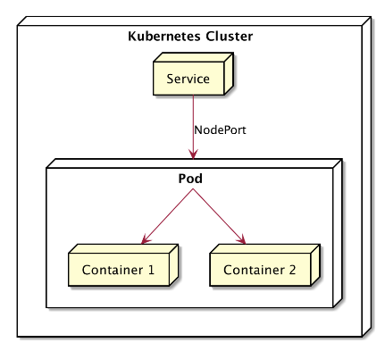

# MULTI CONTAINER POD
Di Docker bisa membuat 1 aplikasi didalam 1 container, Namun berbeda dengan Kubernetes Aplikasi akan dibuat didalam Pod, Didalam Pod bisa menambahkan lebih dari 1 container.Untuk Aplikasi yang ingin dijalankan di beberapa container ini bisa dan jika harus di scale maka semua aplikasi akan ikut scale.

## TOPOLOGI MULTI CONTAINER POD


## Implementasi 

1. Running RS, Service, Pod
```bash
controlplane ~/nodejs-web ➜  kubectl apply -f multi-container-pod.yaml 
replicaset.apps/nginx created
service/nginx-service unchanged
pod/curl unchanged
```

2. Melihat semua resource berjalan
```bash
controlplane ~/nodejs-web ➜  kubectl get all
NAME              READY   STATUS    RESTARTS   AGE
pod/curl          1/1     Running   0          3m20s
pod/nginx-dlw4f   2/2     Running   0          90s
pod/nginx-hsx6b   2/2     Running   0          90s
pod/nginx-pml59   2/2     Running   0          90s

NAME                    TYPE        CLUSTER-IP       EXTERNAL-IP   PORT(S)             AGE
service/kubernetes      ClusterIP   172.20.0.1       <none>        443/TCP             3h47m
service/nginx-service   ClusterIP   172.20.154.197   <none>        8080/TCP,2120/TCP   3m20s

NAME                    DESIRED   CURRENT   READY   AGE
replicaset.apps/nginx   3         3         3       90s
```

3.Mencoba curl langsung dari vm ke Webserver Nginx
```bash
controlplane ~/nodejs-web ➜  curl http://172.20.154.197:8080
<!DOCTYPE html>
<html>
<head>
<title>Welcome to nginx!</title>
<style>
html { color-scheme: light dark; }
body { width: 35em; margin: 0 auto;
font-family: Tahoma, Verdana, Arial, sans-serif; }
</style>
</head>
<body>
<h1>Welcome to nginx!</h1>
<p>If you see this page, the nginx web server is successfully installed and
working. Further configuration is required.</p>

<p>For online documentation and support please refer to
<a href="http://nginx.org/">nginx.org</a>.<br/>
Commercial support is available at
<a href="http://nginx.com/">nginx.com</a>.</p>

<p><em>Thank you for using nginx.</em></p>
</body>
</html>
```

4. Curl Ke Website NodeJS
```bash
controlplane ~/nodejs-web ➜  curl http://172.20.154.197:2120
<!DOCTYPE html>
<html lang="en">
<head>
  <meta charset="UTF-8">
  <meta name="viewport" content="width=device-width, initial-scale=1.0">
  <title>Website Mochamad Abdul Rouf</title>
  <style>
    body { font-family: sans-serif; display: flex; justify-content: center; align-items: center; height: 100vh; background-color: #f0f0f0; }
    .container { text-align: center; }
  </style>
</head>
<body>
  <div class="container">
    <h1>Website Mochamad Abdul Rouf</h1>
    <p>Selamat datang!!</p>
  </div>
</body>
</html>
```

5. Curl dari Container ke Webserver Nginx dan Aplikasi NodeJS
```bash
controlplane ~/nodejs-web ➜  kubectl exec curl -it -- /bin/sh
/ # curl 172.20.154.197:8080
<!DOCTYPE html>
<html>
<head>
<title>Welcome to nginx!</title>
<style>
html { color-scheme: light dark; }
body { width: 35em; margin: 0 auto;
font-family: Tahoma, Verdana, Arial, sans-serif; }
</style>
</head>
<body>
<h1>Welcome to nginx!</h1>
<p>If you see this page, the nginx web server is successfully installed and
working. Further configuration is required.</p>

<p>For online documentation and support please refer to
<a href="http://nginx.org/">nginx.org</a>.<br/>
Commercial support is available at
<a href="http://nginx.com/">nginx.com</a>.</p>

<p><em>Thank you for using nginx.</em></p>
</body>
</html>
/ # curl 172.20.154.197:2120
<!DOCTYPE html>
<html lang="en">
<head>
  <meta charset="UTF-8">
  <meta name="viewport" content="width=device-width, initial-scale=1.0">
  <title>Website Mochamad Abdul Rouf</title>
  <style>
    body { font-family: sans-serif; display: flex; justify-content: center; align-items: center; height: 100vh; background-color: #f0f0f0; }
    .container { text-align: center; }
  </style>
</head>
<body>
  <div class="container">
    <h1>Website Mochamad Abdul Rouf</h1>
    <p>Selamat datang!!</p>
  </div>
</body>
</html>
/ #
```

### Berhasil melakukan Implementasi dengan hasil Curl yang menghasilkan Balasan dari Service pada Port Webserver dan NodeJS