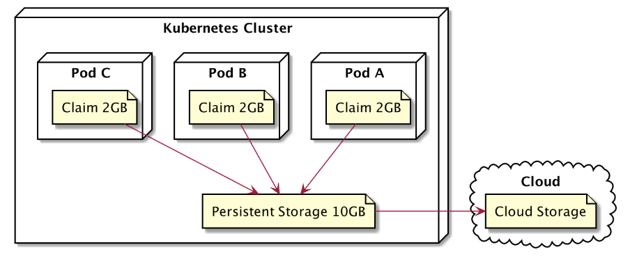

# PERSISTENCE DISK
Persistence Volume adalah sebuah Volume yang mirip dengan Volume biasanya, namun Persistence memiliki siklus hidup yang berbeda dengan Volume biasanya.Untuk Volume biasa seperti emptyDir, Siklus hidupnya terikat pada Siklus hidup Pod.Jadi ketika Pod di hapus maka Volume biasa akan ikut terhapus dan hilang.Berbeda dengan Persistence walau Pod rusak dan terhapus.Persistence disk tetap ada.Jadi inilah penyebabnya volume biasa hanya cocok untuk data sementara dan sharing file sementara antar container.

## TAHAPAN PERSISTENT VOLUME
- Membuat Persistent Volume
- Membuat Persistent Volume Claim
- Menambahkan Persistent Volume Claim ke Pod

## TOPOLOGI PERSISTENT DISK


## Jenis-Jenis Persintent DIsk
- Host Path, Berkas di simpan ke Node, Tidak di rekomendasikan untuk Production hanya untuk testing
- GCEPersistentDisk, Google Cloud Persistent Disk
- AWSElasticBlockStore, Amazon Web Service Persistent Disk
- AzureFile / AzureDisk, Microsoft Azure Persistent Disk
- DLL.

## COMMAND MELIHAT PERSISTENT DISK VOLUME/CLAIM

1. Melihat PV 
```bash
kubectl get pv
```

2. Melihat lebih lengkap PV
```bash
kubectl describe pv namapv
```

3. Melihat PVC
```bash
kubectl get pvc
```

4. Melihat lebih lengkap PVC
```bash
kubectl describe pvc namapvc
```

5. Menghapus PV
```bash
kubectl delete pv namapv
```

6. Menghapus PVC
```bash
kubectl delete pvc namapvc 
```

## IMPLEMENTASI PERSITENT DISK VOLUME/CLAIM

1. Running PV,PVC,POD
```bash
controlplane ~/persistence-volume ➜  kubectl apply -f persistent-volume.yaml 
persistentvolume/nodejs-writer-volume created
persistentvolumeclaim/nodejs-writer-claim created
pod/nodejs-pod created
```

2. Melihat status apakah PV,PVC,POD berjalan.Terlihat status PV dan PVC bound yang artinya keduanya berhasil terhubung dan Pod berhasil running
```bash
controlplane ~/persistence-volume ➜  kubectl get -f persistent-volume.yaml 
NAME                                    CAPACITY   ACCESS MODES   RECLAIM POLICY   STATUS   CLAIM                         STORAGECLASS   VOLUMEATTRIBUTESCLASS   REASON   AGE
persistentvolume/nodejs-writer-volume   5Gi        RWO            Retain           Bound    default/nodejs-writer-claim                  <unset>                          26s

NAME                                        STATUS   VOLUME                 CAPACITY   ACCESS MODES   STORAGECLASS   VOLUMEATTRIBUTESCLASS   AGE
persistentvolumeclaim/nodejs-writer-claim   Bound    nodejs-writer-volume   5Gi        RWO                           <unset>                 26s

NAME             READY   STATUS    RESTARTS   AGE
pod/nodejs-pod   1/1     Running   0          26s
```

3. Memverifikasi apakah persistent volume berhasil di terapkan didalam container.
```bash
controlplane ~/persistence-volume ➜  kubectl exec nodejs-pod -it -- /bin/sh
/app # ls
html       writer.js
/app # cat html/index.html 
<html><body>Sat Oct 18 2025 04:38:54 GMT+0000 (Coordinated Universal Time)</body></html>/app #
```


