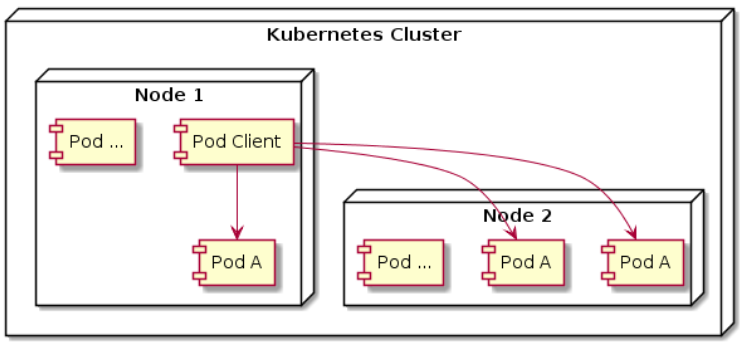
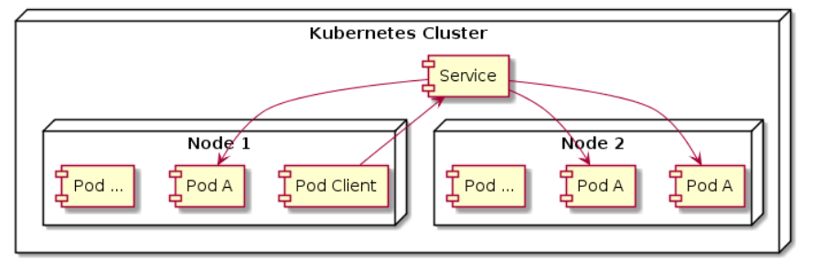
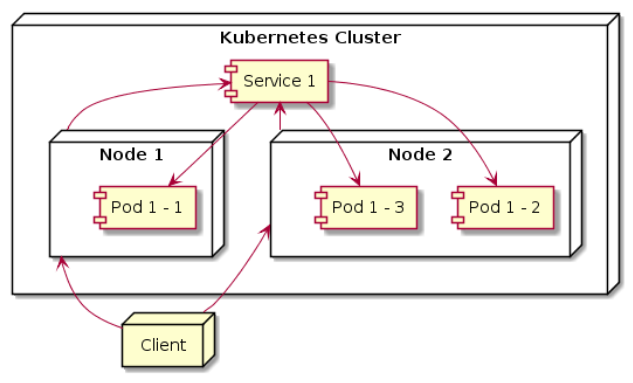

# SERVICE on KUBERNETES
Service adalah sebuah gerbang untuk membuka akses untuk satu atau lebih Pod.Service memiliki IP address dan Port yang tidak pernah berubah selama servicenya masih ada.

Client bisa mengakses service tersebut, dan secara otomatis akan meneruskan ke Pod yang ada di belakang service tersebut.Dengan begini client tidak perlu tahu lokasi tiap Pod dan Pod bisa berkurang,bertambah,berubah,berpindah tanpa menganggu client.

## TOPOLOGI SERVICE

### Mengakses Pod Langsung


### Mengakses Pod Via Service


# Membuat Service
**Bagaimana menentukan Pod Untuk Service?** Service akan mendistribusikan traffic ke Pod yang ada dibelakangnya secara seimbang, Service akan menggunakan label selector untuk mengetahui Pod mana yang ada di belakang service tersebut

## Implementasi membuat service

1. Running Pod, Service, Replica Set
```bash
controlplane ~/nginx-service ➜  kubectl apply -f nginx-service.yaml 
replicaset.apps/nginx created
service/nginx-service created
pod/curl created
```

2. Lihat Pod
```bash
controlplane ~/nginx-service ➜  kubectl get pod -o wide
NAME          READY   STATUS    RESTARTS   AGE   IP           NODE     NOMINATED NODE   READINESS GATES
curl          1/1     Running   0          80s   172.17.1.3   node01   <none>           <none>
nginx-28szp   1/1     Running   0          80s   172.17.1.4   node01   <none>           <none>
nginx-dmd9t   1/1     Running   0          80s   172.17.1.5   node01   <none>           <none>
nginx-ds2kn   1/1     Running   0          80s   172.17.1.2   node01   <none>           <none>
```

3. Lihat Detail Label Pod
```bash
controlplane ~/nginx-service ➜ kubectl get pod --show-labels
NAME          READY   STATUS    RESTARTS   AGE     LABELS
curl          1/1     Running   0          7m36s   name=curl
nginx-28szp   1/1     Running   0          7m36s   web=nginx
nginx-dmd9t   1/1     Running   0          7m36s   web=nginx
nginx-ds2kn   1/1     Running   0          7m36s   web=nginx
```

4. Lihat Service 
```bash
controlplane ~/nginx-service ➜ kubectl get svc
NAME            TYPE        CLUSTER-IP      EXTERNAL-IP   PORT(S)    AGE
kubernetes      ClusterIP   172.20.0.1      <none>        443/TCP    38m
nginx-service   ClusterIP   172.20.89.190   <none>        8080/TCP   3m45s
```

5. Detail service
```bash
controlplane ~/nginx-service ➜  kubectl get svc -o wide
NAME            TYPE        CLUSTER-IP      EXTERNAL-IP   PORT(S)    AGE     SELECTOR
kubernetes      ClusterIP   172.20.0.1      <none>        443/TCP    40m     <none>
nginx-service   ClusterIP   172.20.89.190   <none>        8080/TCP   6m36s   web=nginx
```

6. Testing menggunakan aplikasi tester dari image saya
```bash
controlplane ~/nginx-service ➜  kubectl exec curl -it -- /bin/sh
/ # curl http://172.20.89.190:8080/
<!DOCTYPE html>
<html>
<head>
<title>Welcome to nginx!</title>
<style>
html { color-scheme: light dark; }
body { width: 35em; margin: 0 auto;
font-family: Tahoma, Verdana, Arial, sans-serif; }
</style>
</head>
<body>
<h1>Welcome to nginx!</h1>
<p>If you see this page, the nginx web server is successfully installed and
working. Further configuration is required.</p>

<p>For online documentation and support please refer to
<a href="http://nginx.org/">nginx.org</a>.<br/>
Commercial support is available at
<a href="http://nginx.com/">nginx.com</a>.</p>

<p><em>Thank you for using nginx.</em></p>
</body>
</html>
/ # exit 
```

# Mengakses Service
**Bagaimana Cara Mengakses Service** Misal Aplikasi di Pod butuh mengakses Pod lain, Bagaimana cara mengetahu IP Address Service tersebut? Cara manual adalah dengan membuat service lalu memasukan konfigurasi aplikasinya secara manual.Cara otomatis menggunakan:
- Environment variable
- DNS

1. Melihat Environment Variable
```bash
kubectl exec namapod -- env
```
* Implementasi
```bash
controlplane ~/nginx-service ➜ kubectl exec nginx-28szp -- env
PATH=/usr/local/sbin:/usr/local/bin:/usr/sbin:/usr/bin:/sbin:/bin
HOSTNAME=nginx-28szp
NGINX_VERSION=1.29.1
NJS_VERSION=0.9.1
NJS_RELEASE=1~bookworm
PKG_RELEASE=1~bookworm
DYNPKG_RELEASE=1~bookworm
KUBERNETES_PORT=tcp://172.20.0.1:443
KUBERNETES_PORT_443_TCP_PORT=443
NGINX_SERVICE_PORT=tcp://172.20.89.190:8080
NGINX_SERVICE_PORT_8080_TCP=tcp://172.20.89.190:8080
NGINX_SERVICE_PORT_8080_TCP_PORT=8080
NGINX_SERVICE_PORT_8080_TCP_ADDR=172.20.89.190
KUBERNETES_PORT_443_TCP_ADDR=172.20.0.1
KUBERNETES_SERVICE_PORT=443
KUBERNETES_SERVICE_PORT_HTTPS=443
KUBERNETES_PORT_443_TCP_PROTO=tcp
NGINX_SERVICE_SERVICE_PORT=8080
NGINX_SERVICE_PORT_8080_TCP_PROTO=tcp
KUBERNETES_SERVICE_HOST=172.20.0.1
KUBERNETES_PORT_443_TCP=tcp://172.20.0.1:443
NGINX_SERVICE_SERVICE_HOST=172.20.89.190
HOME=/root
```

2. Melihat semua Endpoint
```bash
controlplane ~/nginx-service ➜  kubectl get endpoints
Warning: v1 Endpoints is deprecated in v1.33+; use discovery.k8s.io/v1 EndpointSlice
NAME            ENDPOINTS                                   AGE
kubernetes      192.168.140.46:6443                         62m
nginx-service   172.17.1.2:80,172.17.1.4:80,172.17.1.5:80   27m
```

3. Menggunakan Domain

- Masuk ke Container curl dulu
```bash
kubectl exec curl -it -- /bin/sh
```

example 
```bash
nama-service.nama-namespace.svc.cluster.local
```

- Lalu curl ke domain service
```bash
/ # curl http://nginx-service.default.svc.cluster.local:8080/
<!DOCTYPE html>
<html>
<head>
<title>Welcome to nginx!</title>
<style>
html { color-scheme: light dark; }
body { width: 35em; margin: 0 auto;
font-family: Tahoma, Verdana, Arial, sans-serif; }
</style>
</head>
<body>
<h1>Welcome to nginx!</h1>
<p>If you see this page, the nginx web server is successfully installed and
working. Further configuration is required.</p>

<p>For online documentation and support please refer to
<a href="http://nginx.org/">nginx.org</a>.<br/>
Commercial support is available at
<a href="http://nginx.com/">nginx.com</a>.</p>

<p><em>Thank you for using nginx.</em></p>
</body>
</html>
/ # 
```


# Service External
Service biasanya digunakan untuk komunikasi internal antar Pod, Namun ada juga Service yang bisa gunakan untuk komunikasi dengan aplikasi external yang berada di luar kubernetes cluster yaitu bernama **Service External**.

### Implementasi Service External
Disini coba membuat hubungan koneksi external dengan website example.com menggunakan **Service External**.

1. Running Pod dan Service External
```bash
controlplane ~/example ➜  kubectl apply -f service.yaml 
service/example-service created
pod/curl created
```

2. Lihat Service dan Pod
```bash
controlplane ~/example ➜  kubectl get pod
NAME   READY   STATUS    RESTARTS   AGE
curl   1/1     Running   0          7s

controlplane ~/example ➜  kubectl get svc
NAME              TYPE           CLUSTER-IP   EXTERNAL-IP   PORT(S)   AGE
example-service   ExternalName   <none>       example.com   80/TCP    12s
kubernetes        ClusterIP      172.20.0.1   <none>        443/TCP   3h34m
```

3. Masuk ke Container Tester dan Mencoba curl ke example.com menggunakan Koneksi dari Service External
```bash
controlplane ~/example ➜  kubectl exec curl -it -- /bin/sh
/ # curl http://example.com/
<!doctype html>
<html>
<head>
    <title>Example Domain</title>

    <meta charset="utf-8" />
    <meta http-equiv="Content-type" content="text/html; charset=utf-8" />
    <meta name="viewport" content="width=device-width, initial-scale=1" />
    <style type="text/css">
    body {
        background-color: #f0f0f2;
        margin: 0;
        padding: 0;
        font-family: -apple-system, system-ui, BlinkMacSystemFont, "Segoe UI", "Open Sans", "Helvetica Neue", Helvetica, Arial, sans-serif;
        
    }
    div {
        width: 600px;
        margin: 5em auto;
        padding: 2em;
        background-color: #fdfdff;
        border-radius: 0.5em;
        box-shadow: 2px 3px 7px 2px rgba(0,0,0,0.02);
    }
    a:link, a:visited {
        color: #38488f;
        text-decoration: none;
    }
    @media (max-width: 700px) {
        div {
            margin: 0 auto;
            width: auto;
        }
    }
    </style>    
</head>

<body>
<div>
    <h1>Example Domain</h1>
    <p>This domain is for use in illustrative examples in documents. You may use this
    domain in literature without prior coordination or asking for permission.</p>
    <p><a href="https://www.iana.org/domains/example">More information...</a></p>
</div>
</body>
</html>
/ # 
```

# Service Node Port


!<Topology Node Poer>


## Topology Node Port


- 1. Running Replica Set dan Service
```bash
controlplane ~/node-port ➜  kubectl apply -f service-node-port.yaml 
replicaset.apps/nginx created
service/nginx-service unchanged
```

- 2. Lihat pada bagian PORT di service yang telag dibuat
```bash
controlplane ~/node-port ➜  kubectl get service nginx-service -o wide
NAME            TYPE       CLUSTER-IP     EXTERNAL-IP   PORT(S)        AGE     SELECTOR
nginx-service   NodePort   172.20.60.58   <none>        80:30001/TCP   3m52s   web=nginx
```