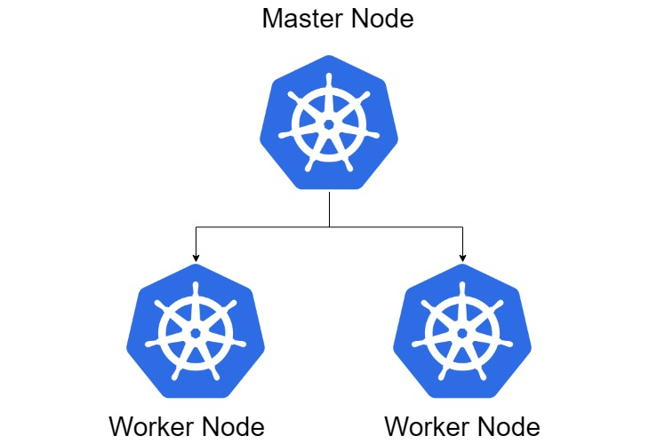
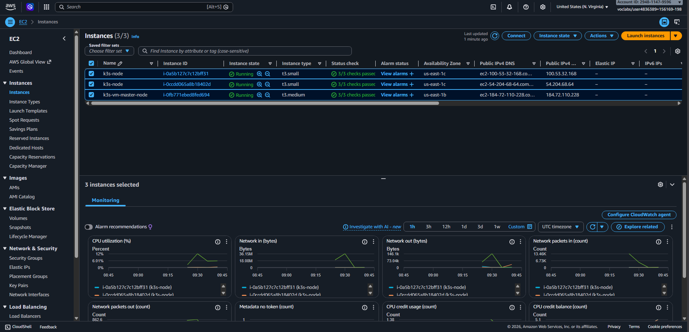

# Setup K3S Multi Node
Lab ini akan membahas mengenai cara setup multi node cluster menggunakan K3S, keuntungan setup multi node yaitu High availability(Ketersediaan tinggi), Scalability(Kemudahan menambah kapasitas), Load Balancing(Pembagian beban), Fault Tolerance(Tahan terhadap kesalahan), dan Zero Downtime(Update tanpa down).

## Architecture Overview


### Spesifikasi VM
Saya menggunakan 3 VM, dengan masing masing 1 Master Node dan 2 Worker Node. Berikut Rinciannya:
1. k3s-vm-master-node.
2. k3s-node (2).


### Installing K3S

1. Install k3s menggunakan command berikut
```bash
curl -sfL https://get.k3s.io | sh -
```
2. Check status k3s
```bash
systemctl status k3s
```
3. Check default object k3s
```bash
sudo kubectl get all -n kube-system
```
4. By default, kita tidak bisa menggunakan command kubectl langsung harus menggunakan sudo terlebih dahulu. jika tidak akan terjadi error berikut
```bash
OutputWARN[0000] Unable to read /etc/rancher/k3s/k3s.yaml, please start server with --write-kubeconfig-mode to modify kube config permissions
error: error loading config file "/etc/rancher/k3s/k3s.yaml": open /etc/rancher/k3s/k3s.yaml: permission denied
```
5. Ubah permission config file menggunakan chmod
```bash
sudo chmod 644 /etc/rancher/k3s/k3s.yaml
```

6. Copy token dari master node 
```bash
sudo cat /var/lib/rancher/k3s/server/node-token
```

7. Jika di master node sudah terinstall k3s, kita tinggal setup worker node dengan command berikut
```bash
curl -sfL https://get.k3s.io | K3S_URL=https://<PRIVATE_IP_MASTER>:6443 K3S_TOKEN=<TOKEN-MASTER-NODE> sh -
```
example
```bash
curl -sfL https://get.k3s.io | K3S_URL=https://10.0.2.230:6443 K3S_TOKEN=K102ae08c89321bd487c6b5c18d03e
2689ffe881d88a471021eb3047deb024a8b83::server:e6eb62aea59d4b0840e9a9c43d3420b8 sh -
```

8. Best practice dari multi node adalah master node tidak boleh ikut menjalankan object agar tidak crash, kita bisa mencegah supaya master node tidak menerima pod aplikasi menggunakan taint.
```bash
kubectl taint nodes <nama-node-master> node-role.kubernetes.io/master=true:NoSchedule
```
example
```bash
ubuntu@master-node:~$ k get nodes
NAME            STATUS   ROLES           AGE   VERSION
ip-10-0-2-230   Ready    control-plane   61m   v1.34.6+k3s1
node-1          Ready    <none>          31m   v1.34.6+k3s1
node-2          Ready    <none>          29m   v1.34.6+k3s1
```
```bash
kubectl taint nodes ip-10-0-2-230 node-role.kubernetes.io/master=true:NoSchedule
```
