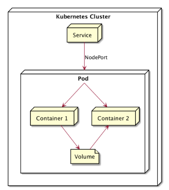
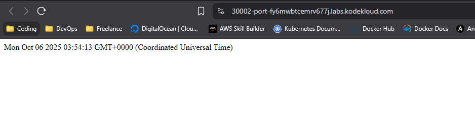

# SHARING VOLUME
 Di Pod membuat lebih dari satu container itu bisa, Maka Volume di Pod pun bisa kita Sharing ke Beberapa Container.Contoh Container pertama membuat file, Container kedua memproses file.

## TOPOLOGI SHARING VOLUME


## Alur Kerja Sharing Volume Aplikasi NodeJS dan WebServer Nginx
Kedua Container menggunakan 1 volume yang sama bernama *html* dan kedua container terhubung ke volume tersebut yang membuat NodeJS berbagi file *index.html*nya yang ada di direktori */app/html* ke Volume *html* dan Nginx hanya akan menampilkan hasil volume html yang telah di sharing volume dari NodeJS, Karena volume *html* telah dipasang ke direktori */usr/share/nginx/html* yang terhubung langsung dengan tampilan webserver Nginx.

## Implementasi Sharing Volume

1. Running ReplicaSet, Pod, Service
```bash 
controlplane ~/sharing-volume ➜  kubectl apply -f sharing-volume.yaml 
replicaset.apps/nginx created
service/nginx-service created
```

2. Melihat semua resource
```bash 
controlplane ~/sharing-volume ➜  kubectl get all
NAME              READY   STATUS    RESTARTS   AGE
pod/nginx-6c4pr   2/2     Running   0          12s
pod/nginx-jd5mt   2/2     Running   0          12s
pod/nginx-vv9lm   2/2     Running   0          12s

NAME                    TYPE        CLUSTER-IP      EXTERNAL-IP   PORT(S)          AGE
service/kubernetes      ClusterIP   172.20.0.1      <none>        443/TCP          64s
service/nginx-service   NodePort    172.20.59.167   <none>        8082:30002/TCP   12s

NAME                    DESIRED   CURRENT   READY   AGE
replicaset.apps/nginx   3         3         3       12s
```

3. Testing menggunakan curl didalam VM
```bash 
controlplane ~/sharing-volume ➜  curl http://172.20.59.167:8082
<html><body>Mon Oct 06 2025 03:53:13 GMT+0000 (Coordinated Universal Time)</body></html>
```

4. Hasil test Di Browser (Implementasi menggunakan Playground KodeKloud)


## Cara kerja Service NodePort perbedaan akses port 8082 dan 30002
- *Port (8082)* adalah port IP Internal Service (ClusterIP) Port ini hanya bisa diakses di dalam cluster Kubernetes.
- *NodePort (30002)* adalah Port yang dibuka pada setiap IP Node Fisik/VM di Cluster Kubernetes.Ini seperti gerbang yang bisa diakses di luar cluster seperti browser contohnya