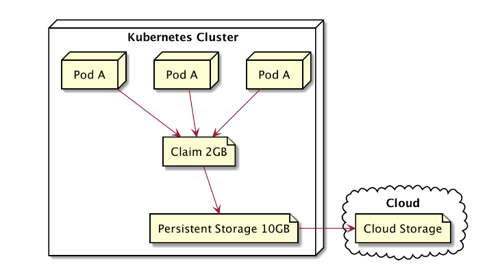
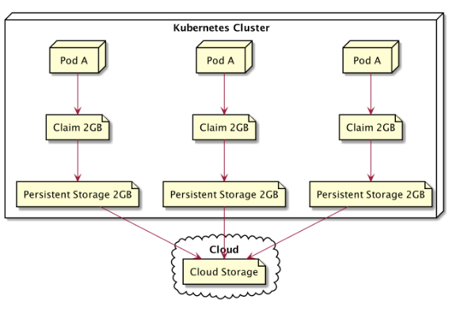

# Stateless Application
Pod, ReplicaSet, Deployment. Itu semua cocok digunakan untuk aplikasi jenis stateless, Stateless artinya aplikasi yang tidak menyimpan data atau state.Jika saat aplikasi sedang berjalan lalu di hapus itu tidak akan membuat masalah.Lalu bagaimana jika Aplikasinya memakai jenis statefull seperti database yang menyimpan seluruh data yang tidak boleh sembarangan di hapus di tengah aplikasi sedang berjalan ketika nantinya sedang melakukan update aplikasi.

## Stateless Persistent Volume
Persistent Volume tidak akan membantu karena semua Pod akan mengclaim Persistent Volume yang sama dan direktori yang sama.Sedangkan jika aplikasi stateful, kemungkinan besar memiliki data idependen di tiap Pod, Walaupun jenis Podnya sama.

# Perbandingan Topologi Stateless PV dan Statefull PV

## TOPOLOGI STATELESS

## TOPOLOGI STATEFULL

Note: Jika di ibaratkan stateless adalah hewan ternak yang nantinya tidak masalah jika di sembelih atau hilang, nah statefull seperti hewan peliharaan yang harus di rawat jika sakit dan jika mati harus cari hewan dengan karakteristiknya yang sama.

# StatefulSet
StatefulSet adalah object di kubernetes yang digunakan untuk memanage aplikasi stateful, StatefulSet akan memastikan nama Pod yang konsisten, identitas Network yang stabil, dan persistent volume yang stabil untuk tiap Pod.Jika ada Pod dengan aplikasi stateful yang mati maka StatefulSet akan membuat Pod lagi dengan nama dan informarsi yang sama dengan Pod yang mati.Jadikan jika memakai persistent volume atau stateless object maka beberapa Pod akan mempunyai PVC dan PV yang sama, namun dengan Stateful Set nantinya setiap Pod akan mempunyai PV dan PVC masing-masing.Dan jika Pod terhapus atau mati maka Kubernetes akan membuat Pod baru dengan koneksi ke PV dan PVC yang sama.

## Aplikasi NodeJS 
Aplikasi ini akan mencatat setiap visit atau kunjungan dari client yang mengakses websitenya lalu akan menulis jumlahnya ke file (state.json), Aplikasi akan menambah nilai penghitung dan menuliskannya ke dalam file lalu file tersebut akan tersimpan di PVC yang terhubung ke PV.Jika Pod baru rusak maka akan di hapus dan dibuat ulang.nantinya Pod baru akan terhubung kembali ke PVC yang sama, Lalu Pod baru dengan aplikasi baru didalamnya akan membaca file (state.json) dari volume dan saat aplikasi dimulai, Fungsi loadState() akan berjalan, Membaca file dari volume, dan melanjutkan hitungannya.

## Implementasi                        