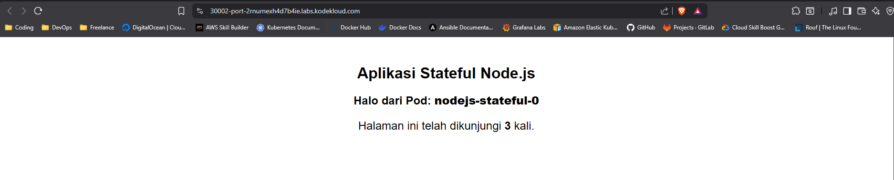

# Stateless Application
Pod, ReplicaSet, Deployment. Itu semua cocok digunakan untuk aplikasi jenis stateless, Stateless artinya aplikasi yang tidak menyimpan data atau state.Jika saat aplikasi sedang berjalan lalu di hapus itu tidak akan membuat masalah.Lalu bagaimana jika Aplikasinya memakai jenis statefull seperti database yang menyimpan seluruh data yang tidak boleh sembarangan di hapus di tengah aplikasi sedang berjalan ketika nantinya sedang melakukan update aplikasi.

## Stateless Persistent Volume
Persistent Volume tidak akan membantu karena semua Pod akan mengclaim Persistent Volume yang sama dan direktori yang sama.Sedangkan jika aplikasi stateful, kemungkinan besar memiliki data idependen di tiap Pod, Walaupun jenis Podnya sama.

# Perbandingan Topologi Stateless PV dan Statefull PV

## TOPOLOGI STATELESS


## TOPOLOGI STATEFULL


Note: Jika di ibaratkan stateless adalah hewan ternak yang nantinya tidak masalah jika di sembelih atau hilang, nah statefull seperti hewan peliharaan yang harus di rawat jika sakit dan jika mati harus cari hewan dengan karakteristiknya yang sama.

# StatefulSet
StatefulSet adalah object di kubernetes yang digunakan untuk memanage aplikasi stateful, StatefulSet akan memastikan nama Pod yang konsisten, identitas Network yang stabil, dan persistent volume yang stabil untuk tiap Pod.Jika ada Pod dengan aplikasi stateful yang mati maka StatefulSet akan membuat Pod lagi dengan nama dan informarsi yang sama dengan Pod yang mati.Jadikan jika memakai persistent volume atau stateless object maka beberapa Pod akan mempunyai PVC dan PV yang sama, namun dengan Stateful Set nantinya setiap Pod akan mempunyai PV dan PVC masing-masing.Dan jika Pod terhapus atau mati maka Kubernetes akan membuat Pod baru dengan koneksi ke PV dan PVC yang sama.

## Alur Aplikasi NodeJS dan StatefulSet
Aplikasi NodeJS yang saya gunakan untuk implementasi object StatefulSet ini mempunyai fitur mencatat setiap visit atau client yang mengakses aplikasi dan akan mencatatnya ke sebuah file (state.json).File tersebut akan ditulis ke direktori Volume Mount yang sudah saya tentukan di (/app/data/).Dan Volume Mount tersebut sudah terhubung ke PVC(penyimpanan) lalu terikat/bound ke PV masing masing Pod.Jadi file state.json tersimpan di PV sebagai penyimpanan fisik dengan perantara PVC dan Volume Mount.

## Implementasi                        

1. Membuat StatefulSet Object
```bash
controlplane ~ ➜  kubectl apply -f statefulset.yaml
```

2. Melihat semua object yang dibuat, Nantinya Pod akan bergantian di buat ketika menggunakan object StatefulSet
```bash
controlplane ~ ➜  kubectl get all
NAME                    READY   STATUS    RESTARTS   AGE
pod/nodejs-stateful-0   1/1     Running   0          66s
pod/nodejs-stateful-1   1/1     Running   0          52s
pod/nodejs-stateful-2   1/1     Running   0          48s

NAME                                 TYPE        CLUSTER-IP      EXTERNAL-IP   PORT(S)          AGE
service/kubernetes                   ClusterIP   172.20.0.1      <none>        443/TCP          70m
service/nodejs-statefulset-service   NodePort    172.20.248.14   <none>        8080:30002/TCP   66s

NAME                               READY   AGE
statefulset.apps/nodejs-stateful   3/3     66s
```

3. Mencoba mengakses aplikasi NodeJS di browser, Ketika di Refresh websitenya maka aplikasi NodeJS akan mencatat setiap traffic yang masuk.


4. Jika coba dilihat di Log Pod memang seperti terlihat error bahwa file (state.json) tidak ditemukan.Namun itu adalah Log awal, Kubernetes tidak akan mencatat Log baru dari sebuah aplikasi. Karena file (state.json) hanya akan dibuat jika Pod sudah running tanpa error jadi ketika Pod pertama kali running maka akan di catat bahwa file tersebut tidak ada di dalam Pod.
```bash
controlplane ~ ➜  kubectl logs nodejs-stateful-0
File state tidak ditemukan. Memulai dari awal.
Server untuk Pod nodejs-stateful-0 berjalan di port 8080
```

5. Jadi jika sebuah Aplikasi didalam Pod sudah menerima traffic masuk ke dalam container.Lalu cek di direktori (/app/data) nantinya akan ada file state.json dan didalamnya akan muncul berapa traffic visit yang sudah masuk.Jumlah itu akan terus berubah seiring banyaknya visit yang masuk ke aplikasi.
```bash
controlplane ~ ➜  kubectl exec nodejs-stateful-0 -it -- /bin/sh
/app # ls
Dockerfile         Dockerfile.v2      app.js             data               node_modules       package-lock.json  package.json
/app # ls data
state.json
/app # cat data/state.json 
{"visits":3}/app #
```

6. Melihat semua object yang di tentukan didalam file konfigurasi, Disitu juga terlihat object StatefulSet yang dibuat.
```bash
controlplane ~ ➜  kubectl get -f stateful.yaml 
NAME                                           CAPACITY   ACCESS MODES   RECLAIM POLICY   STATUS   CLAIM                                                    STORAGECLASS   VOLUMEATTRIBUTESCLASS   REASON   AGE
persistentvolume/nodejs-statefulset-volume-1   2Gi        RWO            Retain           Bound    default/nodejs-stateful-volume-claim-nodejs-stateful-0                  <unset>                          8m56s
persistentvolume/nodejs-statefulset-volume-2   2Gi        RWO            Retain           Bound    default/nodejs-stateful-volume-claim-nodejs-stateful-1                  <unset>                          8m56s
persistentvolume/nodejs-statefulset-volume-3   2Gi        RWO            Retain           Bound    default/nodejs-stateful-volume-claim-nodejs-stateful-2                  <unset>                          8m7s

NAME                               READY   AGE
statefulset.apps/nodejs-stateful   3/3     8m56s

NAME                                 TYPE       CLUSTER-IP      EXTERNAL-IP   PORT(S)          AGE
service/nodejs-statefulset-service   NodePort   172.20.248.14   <none>        8080:30002/TCP   8m56s\
```

6. Melihat PVC (Persistent Volume Claim) yang di buat
```bash
controlplane ~ ➜  kubectl get pvc
NAME                                             STATUS   VOLUME                        CAPACITY   ACCESS MODES   STORAGECLASS   VOLUMEATTRIBUTESCLASS   AGE
nodejs-stateful-volume-claim-nodejs-stateful-0   Bound    nodejs-statefulset-volume-1   2Gi        RWO                           <unset>                 9m11s
nodejs-stateful-volume-claim-nodejs-stateful-1   Bound    nodejs-statefulset-volume-2   2Gi        RWO                           <unset>                 8m57s
nodejs-stateful-volume-claim-nodejs-stateful-2   Bound    nodejs-statefulset-volume-3   2Gi        RWO                           <unset>                 8m53s
```

7. Melihat PV (Persistent Volume)
```bash
controlplane ~ ➜  kubectl get pv
NAME                          CAPACITY   ACCESS MODES   RECLAIM POLICY   STATUS   CLAIM                                                    STORAGECLASS   VOLUMEATTRIBUTESCLASS   REASON   AGE
nodejs-statefulset-volume-1   2Gi        RWO            Retain           Bound    default/nodejs-stateful-volume-claim-nodejs-stateful-0                  <unset>                          9m33s
nodejs-statefulset-volume-2   2Gi        RWO            Retain           Bound    default/nodejs-stateful-volume-claim-nodejs-stateful-1                  <unset>                          9m33s
nodejs-statefulset-volume-3   2Gi        RWO            Retain           Bound    default/nodejs-stateful-volume-claim-nodejs-stateful-2                  <unset>                          8m44s
```